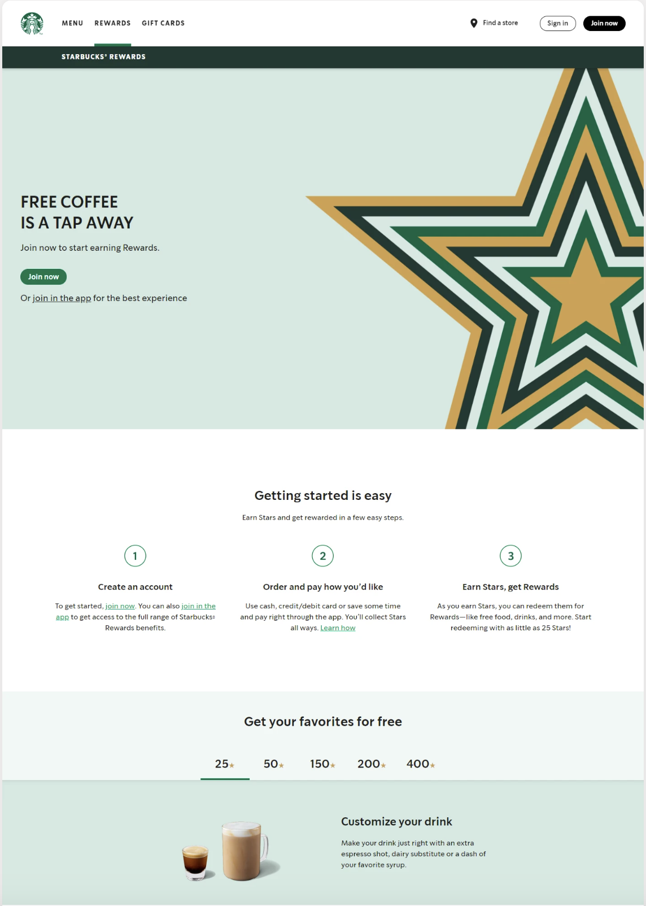
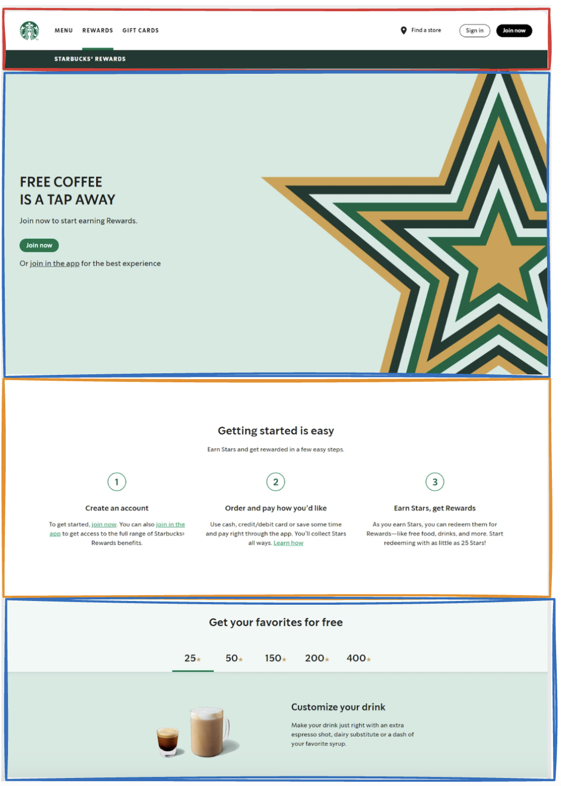

# Group website Workshop

Each team member should tackle a specific section of the website we are going to build (Header, section 1, section 2, and section 3) 

Start by creating a new branch from the branch of your team (e.j. JUL-2024-1). Name this new branch as the feature you are developing, e.g. header-component, section-1, etc. 

In this branch, you will create only the component you are supposed to do inside the index.html file.

## Helpful commands

Move from one branch to another:

`git checkout branch-name`

Create a new branch and automatically move to this branch

`git checkout -b new-branch-name`

Step-by-step process to upload changes to GitHub

- `git add .`
- `git commit -m "commit message"`
- `git push`

## Instructions

### Preparation.

Once you have done the fork, choose a member from your team to create an initial HTML and CSS structure. With this create a PR to your team branch and finally each member should do pull to get those changes.

- Fork the repository.
- Create a new branch from your team branch.
- Open the file `page.html`.
- Each team member should work on one specific feature, and between the team members, decide which feature will be working for each one.
- Once you finish your feature push your changes to Github and then **open a PR against the branch of your team**.
- In case of having **conflicts** on code, make sure you and your team colleague get together to fix it.

The website that we'll creating is the following one from the [Frontend Practice](https://www.frontendpractice.com/projects/starbucks)  Website:

We will divide it on sections in the following way:

In case of been a three group members get until the orange section box, otherwise complete each of the sections.

> You will find all the resources that you need on the folder assets.
